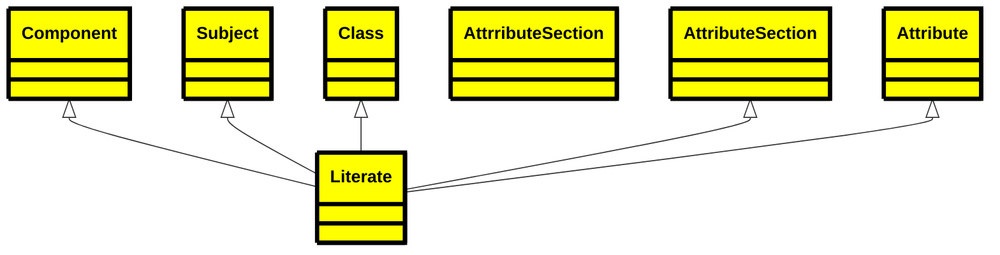
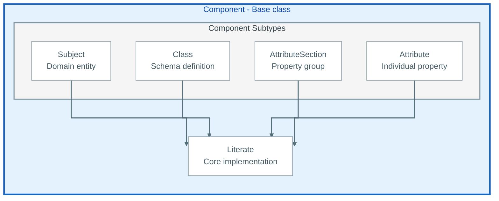
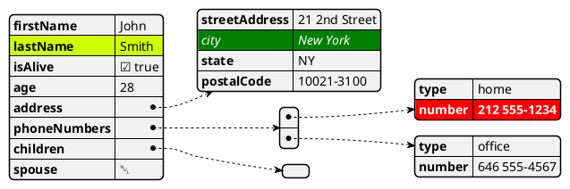
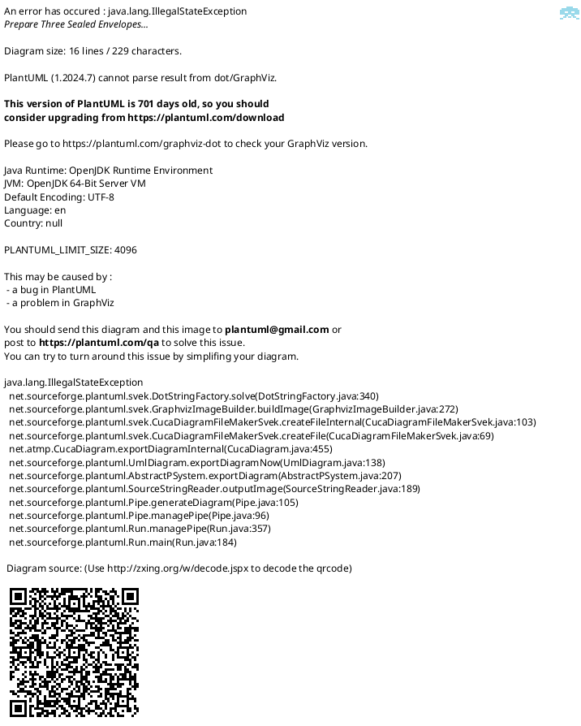
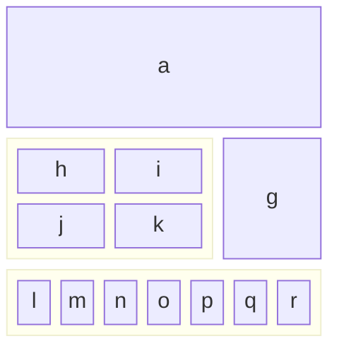
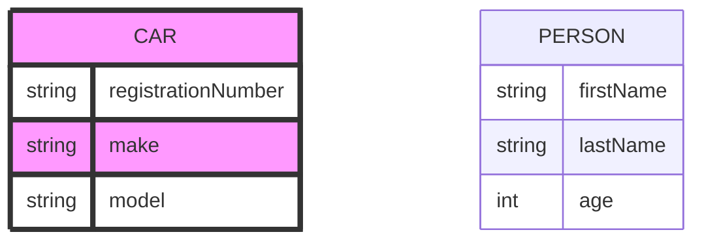
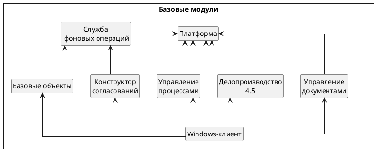

# This is my first Mermaid test

## Mermaid Class Diagram




## Mermaid Flowchart


## PlantUML jsondata



## PlantUML UML





## Mermaid ER Diagram


## Mermaid ER Diagram

``` mermaid
erDiagram


    class Subject Component
    class Section Component
    class Attribute Component
    class Class Component
    
    SUBJECT {
        string name

    }
    Subject ||--|{ Subject : contains
    Subject ||--|{ Class : contains
    Class {
        string name
    }

    Class ||--|{ Section : contains
    Class ||--|{ Attribute : contains
    Attribute {

        string name
    }
	Section ||--|{ Attribute : contains


```
## Captioned figure
<figure>
  
  <figcaption>Fig.1 - Trulli, Puglia, Italy.</figcaption>
</figure>
And the same figure with figure/caption markup

<figure title="A Drivers License">
	
	<figcaption>My Non-Drivers License</figcaption>
</figure>

## List of Codes

```csv
eFormat, Description
E-Book, 'Kindle or Apple books - etc'
PDF, formatted for printing and direct delivery

```

## UML
```puml

@startuml
nwdiag {
  network {
    Component;
    
    Component -- Literate;
    Component -- Subject;
    Component -- Class;
    Component -- AttributeSection;
    Component -- Attribute;
    
    Subject [description = "Domain entity"];
    Literate [description = "Core implementation"];
    Class [description = "Schema definition"];
    AttributeSection [description = "Property group"];
    Attribute [description = "Individual property"];
  }
}
@enduml
```

## Another UML
```puml
@startuml
component Component {
  component Literate {
    description "Core implementation"
  }
  component Subject {
    description "Domain entity"
  }
  component Class {
    description "Schema definition"
  }
  component AttributeSection {
    description "Property group"
  }
  component Attribute {
    description "Individual property"
  }
  
}
@enduml
```
## Russian UML



